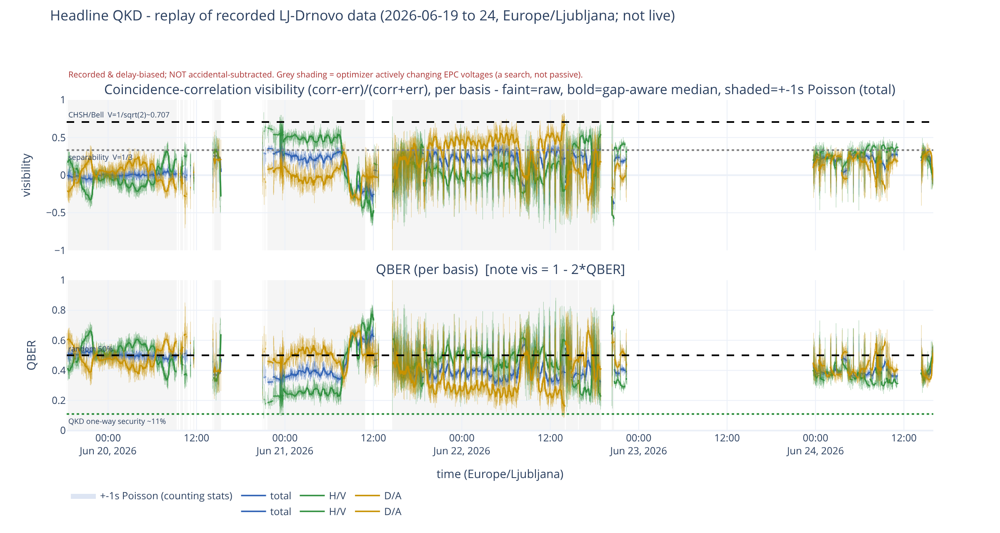
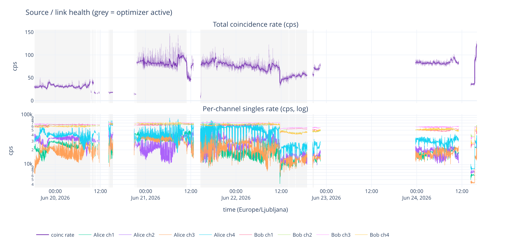
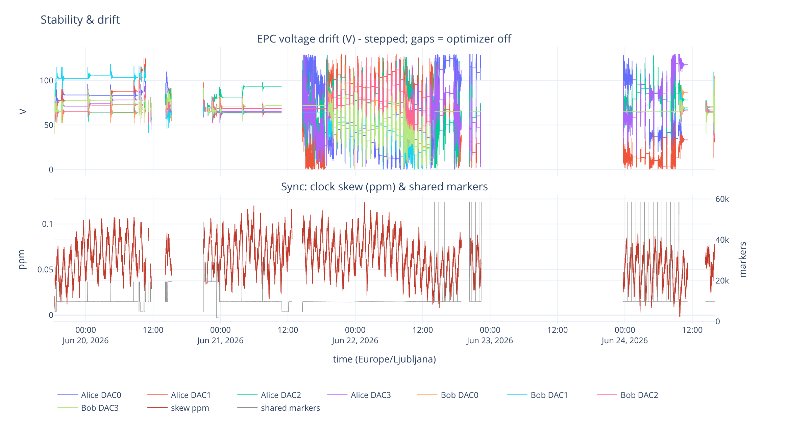
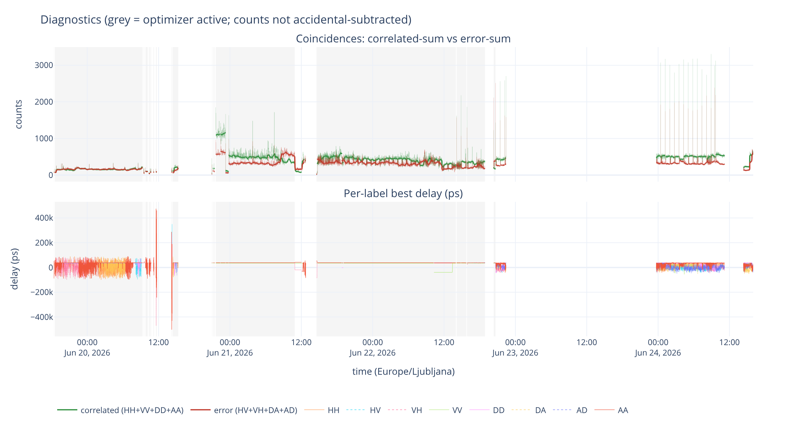

# SiQUID monitor

Monitoring dashboard for the SiQUID long-distance QKD demonstration (Deliverable **D5.3**).
**Currently a recorded-data playback proof-of-concept** — it reads recorded metrics and
replays them as an honest, non-live dashboard, and does not drive hardware or recompute
physics. It is designed to grow into a proper (live) monitoring tool: the data layer is
source-agnostic, so the recorded source can later be swapped for a live feed without
changing the figures.

> ⚠️ **Proof of concept — not a production application.** This is a demonstration
> of monitoring methodology built on a single recorded dataset. It replays static,
> historical data (no live acquisition), uses the Dash development server, and has
> no authentication, persistence, or hardening. Do not deploy it as-is.



▶ **[Watch the demo screencast](assets/SiQUID-dashboard-demo.mp4)** — the running dashboard with KPI tiles, tab navigation, and virtual-clock playback.

## Layout

```
siquid_monitor/   dashboard (Dash app + Plotly figure builders)
notebooks/        viz_explore.ipynb — sandbox that imports siquid_monitor
docs/             public documentation (generated from internal/ — do not hand-edit)
resources/        reference material (e.g. the D4.4 deliverable .docx)
external/         pristine clone of the partner acquisition repo (gitignored, never modified)
                    -> external/long-distance-entanglement/  (code + Data/)
CLAUDE.md         guidance for Claude Code
pyproject.toml    packaging + tooling config
```

Full working docs live in `internal/` (gitignored, not published); the public subset in
`docs/` is generated from them by `tools/build_public_docs.py`. The partner code and its
`Data/` are **not tracked** by this repo. The runtime data path is centralized in
`siquid_monitor/data.DEFAULT_DATA_DIR`.

## Setup

Dependencies are declared in `pyproject.toml` (base = the dashboard runtime;
`dev` = kaleido + requests for figure export / smoke tests; `notebook` = the
Jupyter sandbox).

```bash
python -m venv .venv
.venv/bin/pip install -e ".[dev]"          # or just "." for runtime only
```

The recorded acquisition data comes from the partner acquisition repository. Clone it
into `external/` (it is not distributed with this project), and **check out the pinned
commit** below — the partners actively push new data/code to this repo, and everything
documented here (row counts, figures, screenshots) was validated against that exact state:

```bash
git clone https://github.com/Bogfoot/Long-Distance-Entanglement-Distribution-FMF \
    external/long-distance-entanglement
git -C external/long-distance-entanglement checkout f5f50874a24fafd1119847163a8b08d41e7b9d0e
```

To pick up newer partner data instead, skip the checkout (or `git pull` later) — the
loaders are schema-tolerant, but any specific numbers in the docs may then be stale.

## Run

```bash
.venv/bin/python -m siquid_monitor.app      # or: .venv/bin/siquid-monitor
# -> http://127.0.0.1:8050
```

A four-tab dashboard (Headline QKD / Source / Stability / Diagnostics) with a
virtual-clock playback of the recorded run. See `siquid_monitor/README.md` and
`docs/figures.md` for details. Host/port are overridable via `$HOST` / `$PORT`, and
the data directory via `$SIQUID_DATA_DIR`.

## Screenshots

The four panels (recorded LJ–Drnovo run; values are recorded, delay-biased, not
accidental-subtracted). These are the Plotly figures only — the live app adds KPI tiles,
tab navigation, and playback controls.

| Source / link health | Stability & drift |
|---|---|
|  |  |

| Diagnostics |
|---|
|  |

## Docker

The image contains only the runtime (no kaleido/Chrome); the recorded data is
mounted at runtime rather than baked in.

```bash
docker compose up --build                 # mounts external/…/Data, serves :8050
```

Or without compose:

```bash
docker build -t siquid-monitor .
docker run --rm -p 8050:8050 \
    -v "$PWD/external/long-distance-entanglement/Data:/data:ro" \
    siquid-monitor
```

## Acknowledgements

Developed at the **Jožef Stefan Institute (IJS)**, Ljubljana.

This research and development was funded by the **SiQUID** project:
- <https://siquid.fmf.uni-lj.si/>
- <https://www.gov.si/zbirke/projekti-in-programi/siquid/>

The SiQUID project has received funding from the European Union’s Digital Europe Programme under Grant Agreement No. 101091560.

## License

Apache License 2.0 — see [`LICENSE`](LICENSE). Copyright 2026 Jožef Stefan Institute (IJS).
